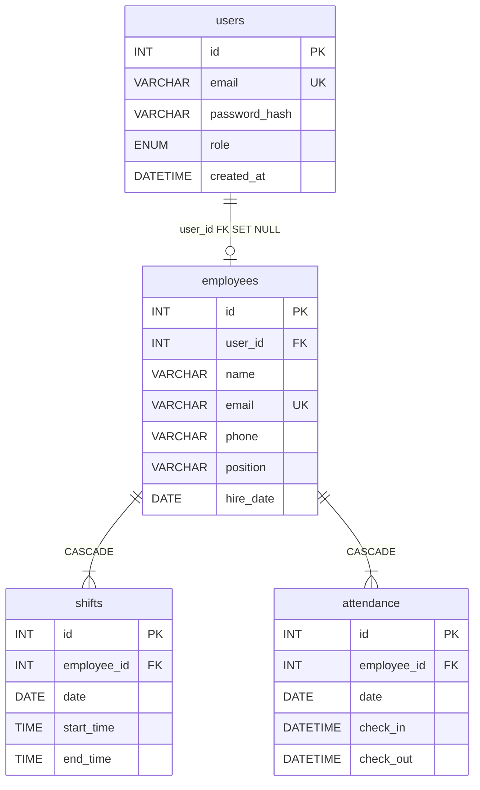

# FSD - Shiftbase

| | |
|---|---|
| Versi | 1.0.0 (2026-09-17) |
| Acuan | PRD v1.0.0 |

## 1. Arsitektur

```text
Browser (web :5173)
  |
  v
API Go/Gin (:8080) — handler -> service -> repository (database/sql, tanpa ORM - ADR-001)
  |
  v
MySQL 8.4 (migrasi goose - ADR-002)          Adminer (:8082, observasi DB)
```

- Backend Go/Gin + MySQL 8.4 + JWT (repo `shiftbase`). Layer: handler -> service -> repository (`database/sql`, tanpa ORM - ADR-001); migrasi goose (ADR-002).
- Frontend Vite + React 19 + TS + Tailwind v4 (repo `shiftbase-web`). Tanpa react-router: navigasi state 4 page, persist `localStorage["shiftbase_page"]`.
- QA: Newman (API) + Playwright TS (UI) + `tools/*.py` (repo `shiftbase-qa`).
- Data: ETL Python -> DuckDB parquet + matplotlib PNG (repo `shiftbase-data`).
- Ops: runbook/SLA/tiket + script backup/restore (repo `shiftbase-ops`).

### 1.1 Konfigurasi & Ports

| Key | Nilai / Contoh | Keterangan |
|---|---|---|
| `PORT` | `8080` | Port API |
| `DB_DSN` | `user:pass@tcp(mysql:3306)/shiftbase` | DSN MySQL (secret, tidak di-commit) |
| `JWT_SECRET` | min 32 char | Secret JWT produksi (secret, tidak di-commit) |
| `FRONTEND_URL` | `http://localhost:5173` | Origin web yang diizinkan CORS |
| `VITE_API_URL` | `http://localhost:8080` | Base URL API di web |

| Service | Port |
|---|---|
| API | 8080 |
| Web (dev) | 5173 |
| Adminer | 8082 |
| MySQL | 3306 (internal compose) |

## 2. Endpoint API

Base `/v1` (kecuali `/healthz`). Auth: `Authorization: Bearer <JWT 24 jam, claims sub=userID, role>`.
Detail request/response per endpoint: `api/swagger.yaml` repo `shiftbase` (lihat kolom Spec).

| ID | Method & Path | Akses | Fungsi | Spec |
|---|---|---|---|---|
| FS-01 | `GET /healthz` | publik | 200 `{"status":"ok"}` | `swagger.yaml:L45` |
| FS-02 | `POST /v1/auth/register` | publik | register, role default staf; req `{email,password}`; 201 + `{token}`; 409 `email_taken` | `swagger.yaml:L51` |
| FS-03 | `POST /v1/auth/login` | publik | login; req `{email,password}`; 200 `{token}`; 401 `invalid_credentials` | `swagger.yaml:L62` |
| FS-04 | `GET /v1/me` | semua | profil sendiri; 401 tanpa token | `swagger.yaml:L73` |
| FS-05 | `POST /v1/employees` | admin | tambah karyawan; req `{name,email,phone,position,hire_date}`; 201; 409 email ganda; 400 format salah | `swagger.yaml:L89` |
| FS-06 | `GET /v1/employees` | admin,manajer | list; 200 `[...]` | `swagger.yaml:L81` |
| FS-07 | `GET /v1/employees/:id` | admin,manajer | detail; 404 bila tak ada | `swagger.yaml:L103` |
| FS-08 | `PUT /v1/employees/:id` | admin | ubah; 404 bila tak ada | `swagger.yaml:L110` |
| FS-09 | `DELETE /v1/employees/:id` | admin | hapus; 204 | `swagger.yaml:L121` |
| FS-10 | `POST /v1/employees/import` | admin,manajer | CSV multipart `file` maks 2 MB -> `{imported,failed,errors[{row,error}]}`; 400 tanpa file/overlimit; 403 staf | `swagger.yaml:L127` |
| FS-11 | `POST /v1/shifts` | admin,manajer | buat shift; req `{employee_id,date,start_time,end_time}`; 201; overlap -> 409 `shift_conflict` | `swagger.yaml:L152` |
| FS-12 | `GET /v1/shifts[?date=&employee_id=]` | semua | list; staf otomatis miliknya; 200 `[...]` | `swagger.yaml:L143` |
| FS-13 | `GET /v1/shifts/:id` | semua | detail; 404 | `swagger.yaml:L166` |
| FS-14 | `PUT /v1/shifts/:id` | admin,manajer | ubah; 409 bila bentrok; 404 | `swagger.yaml:L173` |
| FS-15 | `DELETE /v1/shifts/:id` | admin,manajer | hapus; 204 | `swagger.yaml:L184` |
| FS-16 | `POST /v1/attendance/check-in` | semua | staf auto-sendiri; req `{employee_id?,date}`; 201; duplikat/hari -> 409 | `swagger.yaml:L190` |
| FS-17 | `POST /v1/attendance/check-out` | semua | tanpa check-in terbuka -> 404; 200 | `swagger.yaml:L205` |
| FS-18 | `GET /v1/attendance[?from=&to=&employee_id=]` | semua | riwayat `YYYY-MM-DD`; 200 `[...]` | `swagger.yaml:L220` |
| FS-19 | `GET /v1/reports/overtime[?from=&to=]` | admin,manajer | `[{employee_id,name,total_hours,overtime_hours}]`; 403 staf | `swagger.yaml:L231` |
| FS-20 | `GET /v1/reports/coverage[?date=]` | admin,manajer | `[{date,headcount}]`; 403 staf | `swagger.yaml:L241` |

## 3. Model Data (MySQL, goose `00001`-`00005`)

- `users(id INT AI PK, email VARCHAR(255) UNIQUE, password_hash VARCHAR(255) bcrypt, role ENUM('admin','manager','staff') DEFAULT 'staff', created_at DATETIME)`.
- `employees(id INT AI PK, user_id INT UNIQUE NULL FK->users(id) ON DELETE SET NULL, name VARCHAR(255), email VARCHAR(255) UNIQUE, phone VARCHAR(32) NULL, position VARCHAR(64) DEFAULT 'staff', hire_date DATE, created_at DATETIME)`.
- `shifts(id INT AI PK, employee_id INT FK->employees(id) ON DELETE CASCADE, date DATE, start_time TIME, end_time TIME, CHECK(end_time>start_time), UNIQUE(employee_id,date,start_time))`.
- `attendance(id INT AI PK, employee_id INT FK->employees(id) ON DELETE CASCADE, date DATE, check_in DATETIME NULL, check_out DATETIME NULL, UNIQUE(employee_id,date), CHECK(check_out>=check_in))`.
- Relasi: `users 1-0/1 employees`; `employees 1-N shifts, attendance`.



## 4. Aturan Bisnis

1. Overlap shift (pegawai sama, rentang jam beririsan) ditolak 409 - dicek di service.
2. Overtime = `GREATEST(jam_kerja - 8, 0)` per karyawan per hari, zona Asia/Jakarta.
3. Satu check-in per karyawan per hari (`UNIQUE(employee_id,date)`).
4. CSV: header persis `name,email,phone,position,hire_date`; maks 2 MB; parsial (baris valid tetap masuk + daftar error).
5. Staf hanya membaca/mencatat miliknya; admin wajib kirim `employee_id` eksplisit bila bertindak untuk orang lain.

## 5. Matriks RBAC

| Resource | admin | manager | staff |
|---|---|---|---|
| employees tulis / baca | Ya / Ya | Tidak / Ya | Tidak / Tidak |
| shifts tulis / baca | Ya / Ya | Ya / Ya | Tidak / miliknya |
| attendance | kelola | kelola | miliknya |
| reports | Ya | Ya | Tidak |
| impor CSV | Ya | Ya | Tidak |

## 6. Web UI

Halaman: Login, Schedule (board timeline 06:00-24:00 per karyawan, date picker WIB), Shifts (tabel + dialog CRUD per tanggal), Attendance (tombol punch + filter + upload CSV), Reports (bar lembur + tabel coverage). Token di `localStorage["shiftbase_token"]`, validasi via `/me`; 401 tampil sebagai pesan (logout manual). Base URL: `VITE_API_URL` default `http://localhost:8080`.

## 7. ETL / Analitik

Alur `run.py`: extract (pymysql read-only 3 tabel) -> quality gates (gagalkan run bila: tabel kosong, orphan, `check_out<=check_in`, `end<=start`, duplikat) -> 5 marts (`hours_daily`, `overtime_employee`, `coverage_daily`, `attendance_rate`, `late_arrivals` telat > 5 mnt) -> parquet DuckDB -> 4 PNG -> cross-check API overtime toleransi < 0,01 -> `work/quality_report.json`.

## 8. Operasional

Compose: `mysql:8.4` (healthcheck) -> `api` (distroless, `depends_on healthy`, :8080) + `adminer` (:8082). Backup: `mysqldump --single-transaction --routines` + gzip, rotasi 7 hari. Restore: konfirmasi `ya` + verifikasi COUNT employees. Seed: 3 akun (`admin/manager/staff@shiftbase.local`) + 5 karyawan fiktif.
